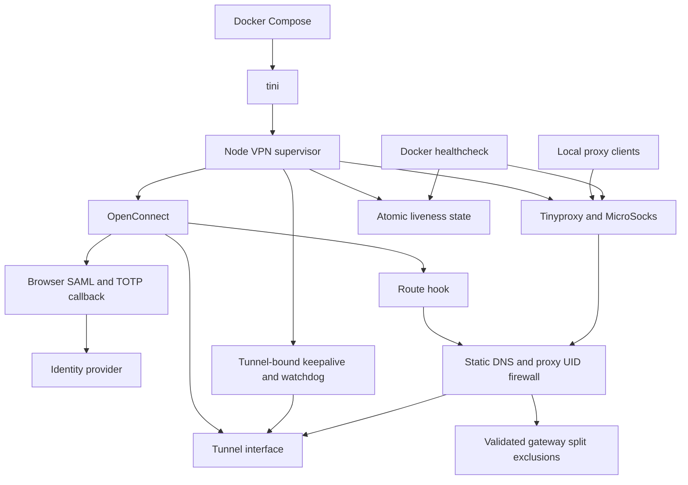

# Autonomous AnyConnect SAML + TOTP VPN proxy

Run an AnyConnect-compatible VPN, unattended browser authentication, and HTTP/SOCKS5
proxies in one Docker container. OpenConnect owns the VPN protocol and SSO callback;
Playwright completes Microsoft-style username, password, and TOTP forms. The host
keeps its normal routes and DNS.

Compose also runs a scoped Watchtower updater that follows the published VPN image.
Both containers use Docker's automatic restart policy.

The HTTP proxy is available at `http://127.0.0.1:8080`; SOCKS5 is available at
`socks5h://127.0.0.1:1080`. Both published ports default to **localhost only** and
require no proxy password. Use `socks5h` for proxy-side DNS resolution.

## Find your starting point

| Task | Start here |
| --- | --- |
| Run the published image | [Startup](#start-from-the-published-image) |
| Run changes from this checkout | [Local build](#build-and-run-this-checkout-locally) |
| Understand readiness and recovery | [Lifecycle](#how-the-pieces-connect) and [recovery behavior](#keepalive-health-and-recovery) |
| Change settings | [Configuration](#configuration) and [.env.sample](.env.sample) |
| Diagnose a running stack | [Verification](#verification-and-diagnostics) and [symptom guide](#diagnose-by-symptom) |
| Modify or review the project | [Root contributor guide](AGENTS.md) and [folder map](#repository-map) |
| Update an image or return to an earlier build | [Image maintenance](#image-maintenance-and-release) |

## How the pieces connect



Startup establishes DNS and firewall policy and captures the public IP before VPN
connection. OpenConnect owns the VPN protocol and calls the browser helper for SSO.
After tunnel liveness and changed egress establish readiness, the supervisor starts
the proxies. Keepalive/watchdog work remains independent of slower egress checks.

The supervisor repairs failed children or starts a new VPN session. When forced
OpenConnect cleanup requires a fresh network namespace, it exits so Docker's restart
policy can restart the container. The route hook refreshes DNS and firewall policy
after OpenConnect changes routes. All of these network changes happen inside the
container; using a proxy is how a client chooses to use the VPN.

## Start from the published image

Requires Linux, Docker Compose v2, `/dev/net/tun`, and permission to grant network
capabilities inside the container. Rootless Docker support depends on the host's
TUN and user-namespace configuration.

```bash
cp .env.sample .env
chmod 600 .env
```

Fill in `VPN_SERVER`, `VPN_USERNAME`, `VPN_PASSWORD`, and `VPN_TOTP_SECRET` in `.env`.
The server must be HTTPS. The TOTP seed can be raw base32, `base32:...`, or an
`otpauth://` URI. The supported generator uses six-digit SHA-1 codes and a 30-second
period; keep the host clock synchronized. Single-quote Compose dotenv values that
contain `$`, `#`, spaces, or other special characters.

```bash
docker compose config --quiet
docker compose up -d --wait --wait-timeout 240
docker compose ps
```

The default image is `ghcr.io/cjangrist/anyconnect-browser-auth:latest` with
`VPN_PULL_POLICY=always`. Configuration rendering without `--quiet` can print secrets.

For rootless Docker, set `VPN_DOCKER_SOCKET` to the host socket path reported by
`docker context inspect` (for example `/run/user/1000/docker.sock`, without `unix://`).
The updater mounts that socket to manage containers; the socket must already exist.
Its label and project-scope filters select only this stack's opted-in VPN container.

The updater checks on startup and every 60 seconds. A new image is downloaded before
the VPN is recreated, then unattended SSO establishes a fresh tunnel. Availability
resumes after authentication; existing connections need client retry. Registry or
network outages delay updates until a later successful check. Compose's pull policy
alone only checks when Compose runs.

Both services use `restart: always`, so Docker restarts them after process exits and
when the Docker daemon starts. The host must already start Docker at boot; rootless
Docker also needs its user daemon available without an interactive login. No separate
VPN host service or scheduler is required. A manual `docker compose stop` remains
effective until you start the stack or restart the Docker daemon.

## Build and run this checkout locally

Set these non-secret values in your private `.env`:

```dotenv
VPN_IMAGE=anyconnect-browser-auth:local
VPN_PULL_POLICY=never
VPN_AUTO_UPDATE_ENABLED=false
```

Pause the updater before changing the running image, then build and start:

```bash
docker compose stop updater
docker compose build vpn
docker compose up -d --wait --wait-timeout 240
```

This keeps subsequent `docker compose up` operations on the local build. Changing
source alone does not update a running container: rebuild and run `up` again.
`COMPOSE_PROJECT_NAME` selects the local stack name.

## Keepalive, health, and recovery

One ICMP echo is sent **every second**, rotating across five default targets:
`1.1.1.1`, `8.8.8.8`, `9.9.9.9`, `208.67.222.222`, and `94.140.14.14`.
Each target receives one echo every five seconds. Every ping binds explicitly to
`tun0`, so replies over the ordinary host-facing route cannot make a dead VPN look
healthy. Pings have a bounded lifetime and stop with their VPN session.

The liveness watchdog runs independently of web requests and proxy probes. It checks
the interface's administrative state and the most recent successful tunnel-bound
reply. One unavailable responder does not interrupt service. With the defaults, a
complete loss of replies becomes stale after 15 seconds; three failed watchdog ticks
trigger recovery. A missing or down interface is detected without waiting for stale
ping replies.

Before starting proxies, the supervisor records the pre-VPN public IP, waits for
successful tunnel keepalives, and verifies that VPN egress differs from the baseline.
Baseline collection retries if the Internet or an IP-reporting endpoint is unavailable.

Docker's routine `healthcheck` reads an atomically published local state file and
checks both proxy protocols. It makes **no website requests**. The state includes
readiness and a timestamp, so an old file cannot keep a dead supervisor healthy.

Deeper egress checks run every five minutes by default. They rotate through the HTTPS
IP-reporting pool in [src/config.js](src/config.js) and try up to three endpoints per
check. A single website's rate limit, invalid response, or certificate failure does
not restart the VPN. A
confirmed return to the baseline IP requests a reconnect. Repeated transport failures
across the fallback endpoints also request recovery. Manual `deep-healthcheck` performs
fresh direct, HTTP-proxy, and SOCKS-proxy egress checks and may take up to about 27
seconds when fallback endpoints time out.

Each proxy is supervised separately. A dead process is replaced at the next supervision
cycle; a hung process must fail three probes before replacement. Restarting HTTP does
not stop SOCKS, and restarting SOCKS does not stop HTTP. Proxy cleanup is bounded and
port reuse waits for the old process to exit. Tinyproxy's client capacity and idle
timeout are configured in [docker/tinyproxy.conf](docker/tinyproxy.conf); the idle
timeout is not a total request deadline.

Both proxy binaries are built from pinned upstream source with a connection-establishment
fix in [docker/proxy-connect-recovery.patch](docker/proxy-connect-recovery.patch).
A TCP attempt gets at most 2.5 seconds, then the proxy tries another resolved address
or a fresh socket. It makes up to two passes through the addresses within a 7.5-second
TCP connection budget. DNS resolution precedes that budget. This repairs connections
whose SYN packets receive no reply even while other connections to the same host work.
Retries happen before application data is sent; established streams are not replayed.
Tinyproxy retains its separately configured inactivity timeout after connecting.

OpenConnect uses a five-second dead-peer detection interval to repair transport
interruptions using its existing session. Once a tunnel interface appears, the first
keepalive reply has a 15-second budget, independent of the longer SSO deadline.
Failed browser authentication reports a session-specific status to the supervisor
so it can retry promptly. When the watchdog requests a new session, it sends SIGTERM
and allows five seconds for exit
before SIGKILL. Remaining authentication descendants are terminated with the old
process group. A forced OpenConnect termination exits the supervisor so Docker can
restart a fresh network namespace. Normal child exit retries browser SSO after five
seconds. SIGTERM to the container stops the children without scheduling another login.

Recovery needs no manual login during the supported SSO/TOTP flow. A broken TCP
connection cannot be resumed across a lost tunnel or dead proxy process; clients must
retry requests interrupted by those events. Gateway or identity-provider outages,
changed MFA policies, and rejected credentials can extend the recovery period.

## Routing and firewall behavior

UID-scoped IPv4 and IPv6 rules protect Tinyproxy and MicroSocks before either starts.
Proxy traffic can leave through `tun0`; established responses to proxy clients are
also allowed. The gateway's explicit split exclusions are honored, including Microsoft
365 destinations when the gateway pushes those prefixes. The gateway's own control
route and unrelated host routes do not become implicit bypass permissions.

The route hook intersects validated pushed exclusions with installed routes. It
refreshes policy on connect/reconnect and revokes the exceptions on disconnect.
Each firewall family is replaced with a single `iptables-restore --noflush`
transaction, avoiding a period with an empty permissive chain. Other chains are
preserved. Ordinary traffic cannot fall back to direct egress when the tunnel fails.
Split-excluded destinations intentionally use the direct route while connected.

The container uses exactly `1.1.1.1`, `1.0.0.1`, `8.8.8.8`, and `8.8.4.4` as DNS
servers. The supervisor writes and verifies that resolver configuration before
baseline capture and authentication, and the route hook reasserts it after network
events. This replaces Docker's embedded resolver and service-name DNS in this container.

Compose drops all capabilities and adds `KILL`, `NET_ADMIN`, `NET_RAW`, `SETUID`, and
`SETGID`. `NET_RAW` permits the image's ping binary. It publishes only TCP proxy ports;
`VPN_PROXY_HOST_IP` explicitly controls their host binding. Logs rotate at three
10-MB files.

## Configuration

Operator settings are listed in the secret-free [.env.sample](.env.sample).
[compose.yaml](compose.yaml) owns image selection, host bindings, and Docker health
timings; [src/config.js](src/config.js) owns supervisor defaults and validation.
Runtime variables are passed through Compose as bare names. Empty optional runtime
values use the source defaults. Internal authentication-session and route-hook
environment is supplied by the supervisor/OpenConnect, not by the operator.

| Setting | Default | Purpose |
| --- | --- | --- |
| `VPN_PROXY_HOST_IP` | `127.0.0.1` | Published host address for both proxies. |
| `VPN_KEEPALIVE_TARGETS` | Five IPs listed above | Comma-separated, deduplicated ICMP targets. |
| `VPN_KEEPALIVE_INTERVAL_SECONDS` | `1` | Aggregate send interval; must be positive and at most one second. |
| `VPN_KEEPALIVE_STALE_MILLISECONDS` | `15000` | Maximum reply age; must exceed a full target rotation plus two seconds. |
| `VPN_LIVENESS_INTERVAL_MILLISECONDS` | `1000` | Independent watchdog cadence. |
| `VPN_LIVENESS_STATE_STALE_MILLISECONDS` | `30000` | Maximum age of supervisor state accepted by healthcheck. |
| `VPN_LEAK_CHECK_INTERVAL_MILLISECONDS` | `300000` | Direct egress verification interval. |
| `VPN_PROXY_EGRESS_CHECK_INTERVAL_MILLISECONDS` | `300000` | Egress verification interval per proxy. |
| `VPN_PROXY_SUPERVISE_INTERVAL_MILLISECONDS` | `15000` | Local proxy supervision interval. |
| `VPN_PROXY_FAILURE_THRESHOLD` | `3` | Consecutive proxy failures before recycling. |
| `VPN_PROXY_PROBE_TIMEOUT_MILLISECONDS` | `5000` | Absolute protocol-probe deadline. |
| `VPN_PROXY_START_TIMEOUT_MILLISECONDS` | `15000` | Proxy readiness budget. |
| `VPN_WATCHDOG_FAILURE_THRESHOLD` | `3` | Consecutive liveness failures before reconnection. |
| `VPN_WATCHDOG_STARTUP_GRACE_MILLISECONDS` | Browser timeout + 30000 | Time allowed for initial SSO/tunnel setup. |
| `VPN_BROWSER_TIMEOUT_MILLISECONDS` | `180000` | Browser authentication deadline. |
| `VPN_PUBLIC_IP_ENDPOINT` | Rotating pool | Optional single HTTPS endpoint returning a plain IP. |
| `VPN_PUBLIC_IP_FAMILY` | `4` | Address family for public-IP verification. |
| `VPN_TUNNEL_INTERFACE` | `tun0` | OpenConnect and keepalive interface. |
| `VPN_HEALTHCHECK_INTERVAL` | `60s` | Docker healthcheck interval, independent of the watchdog. |
| `VPN_HEALTHCHECK_TIMEOUT` | `10s` | Docker healthcheck deadline. |
| `VPN_HEALTHCHECK_RETRIES` | `8` | Docker's consecutive failure count. |
| `VPN_HEALTHCHECK_START_PERIOD` | `90s` | Docker startup grace period. |

The sample also documents browser-profile and runtime-state paths. The baseline
IP file's parent directory holds authentication status and split-exclusion state;
the liveness file has its own configurable path. The browser profile and these
state files live inside the container, with no persistent volume in the supplied
Compose definition. Recreating the container discards that local runtime state.

Docker does not restart a container just because its health status becomes
unhealthy; the supervisor performs recovery, and `restart: always` handles
supervisor exits.

The public-IP check assumes those endpoints use the VPN. Gateways that route all public
Internet traffic directly need a VPN-routed verification endpoint. An IPv6-only setup
also needs suitable IPv6 keepalive targets and a compatible IP-reporting endpoint.

## Verification and diagnostics

```bash
npm ci
npm test
docker compose config --quiet
docker compose exec -T vpn /app/vpn.js self-test
docker compose exec -T vpn /app/vpn.js healthcheck
docker compose exec -T vpn /app/vpn.js deep-healthcheck
curl --fail --proxy http://127.0.0.1:8080 https://api.ipify.org
curl --fail --proxy socks5h://127.0.0.1:1080 https://api.ipify.org
docker compose logs --since 10m vpn
```

The self-test validates credential presence, TOTP generation, exact static resolver
configuration, and an IP-reporting request without printing credentials. It needs
network access and does not perform a fresh browser login. The routine healthcheck
checks fresh readiness plus proxy protocols; the deep check verifies current
application egress. A passed healthcheck cannot establish every site's availability.

### Container command reference

Run these as `docker compose exec -T vpn /app/vpn.js COMMAND` unless noted otherwise.

| Command | Effect and intended use |
| --- | --- |
| `healthcheck` | One local readiness/protocol check; used by Docker. No public website request. |
| `deep-healthcheck` | Local readiness plus fresh direct, HTTP, and SOCKS egress comparisons. |
| `self-test` | Credential/TOTP, resolver, and public-IP request checks; does not prove SSO. |
| `probe` | Repeats the routine check and logs results until interrupted. |
| `connect` | Container entrypoint: owns DNS, firewall, OpenConnect, proxies, and recovery. Do not start a second supervisor in a running stack. |
| `configure-dns` | Internal route-hook operation that rewrites the container resolver. |
| `configure-kill-switch` | Internal route-hook operation that refreshes proxy UID policy using hook environment and installed routes. |
| An SSO URL | Internal OpenConnect external-browser callback; launches authentication for that session. |

The last four forms are lifecycle integration points, not host-side diagnostic
commands. Their implementation is mapped in [src/AGENTS.md](src/AGENTS.md).

### Live recovery validation

[test/live-recovery.cjs](test/live-recovery.cjs) is an **opt-in disruptive local test**.
It can kill or stop proxy/OpenConnect processes and interrupt tunnel traffic. Its
`--phase` values are `browser`, `proxies`, `keepalive`, `tunnel`, `transport`, `firewall`, `syn`,
`egress`, `saturation`, `soak`, and `cleanup`.
The egress phase can take six minutes with the default five-minute deep-check interval.
Run phases sequentially against a dedicated local stack; simultaneous fault injection
invalidates their recovery measurements. Pass `--container`, `--session`, `--browser-config`, and `--output` for
your local setup; `--minutes` controls the soak length. Browser verification requires
an installed `agent-browser` and Chrome. The session and browser config are required
to keep the test isolated from other browser work. This script is excluded from ordinary `npm test`.

Use [test/AGENTS.md](test/AGENTS.md) for a complete invocation, phase selection,
fixture assumptions, and cleanup. Some live phases assume the supplied ports,
interfaces, image user IDs, and a gateway-specific split prefix; inspect these
assumptions before using the harness against another deployment. Keep evidence
outside the repository and retain full logs when an assertion fails.

Inspect `watchdog.liveness.failed`, `watchdog.reconnect.triggered`,
`public_ip.endpoint.failed`, and per-proxy restart events to distinguish tunnel loss,
provider failures, and proxy failures. Authentication logs redact credential values and
SSO material. Keep raw operational logs private.

### Diagnose by symptom

Begin with `docker compose ps`, recent service logs, and the routine healthcheck.
Readiness, VPN transport, proxy protocols, and remote websites are separate layers.

| Symptom | Inspect | Next useful check |
| --- | --- | --- |
| Startup never reaches authentication | `baseline.retry`, resolver setup, reporting endpoints, outbound access. | Container `self-test`; confirm the selected verification endpoint is reachable before VPN connection. |
| Repeated browser authentication failures | Redacted `browser.*` events, credentials, host clock, supported MFA forms. | Verify current identity-provider requirements and the handlers in `src/authentication.js`. |
| Tunnel repeatedly reconnects | `watchdog.liveness.failed`, interface state, keepalive reachability, startup grace. | Check whether all configured targets are reachable through the tunnel; one blocked target alone should be tolerated. |
| One proxy fails while the other works | Its local protocol probe, `check.failed`/`restart` events, egress result. | Test HTTP and SOCKS separately and distinguish local listener failure from destination connection failure. |
| Routine health is good but web requests fail | Fresh egress via `deep-healthcheck`, DNS, requested site's reachability. | Compare another site and both protocols; the routine probe only exercises local proxy protocol responses. |
| Public-IP verification fails intermittently | `public_ip.endpoint.failed` and whether errors are inconclusive or transport failures. | Inspect the configured pool/override and fallback behavior before attributing the failure to the tunnel. |
| Egress equals the pre-VPN baseline | Endpoint route, installed pushed exclusions, expected gateway routing policy. | Use a VPN-routed verification endpoint; do not disable the equality check to make readiness pass. |
| A split-excluded application cannot connect | Gateway-pushed prefixes, installed routes, proxy UID rules. | Follow `network.js` and the [route-hook guide](docker/AGENTS.md); unrelated direct routes do not authorize bypass. |
| A rebuild seems to have no effect | Selected Compose image/pull policy and running container image ID. | Recreate from the intended local tag or published digest; editing source does not replace a running image. |
| Docker reports unhealthy without restarting | Supervisor logs, liveness file freshness, process state. | Diagnose the supervisor; Docker health status itself does not trigger its restart policy. |

Inspect routing/firewall state only in the intended container:

```bash
docker compose exec -T vpn ip -4 route show
docker compose exec -T vpn ip -6 route show
docker compose exec -T vpn iptables -S VPN_PROXY_KILLSWITCH
docker compose exec -T vpn ip6tables -S VPN_PROXY_KILLSWITCH
```

IPv6 rules exist only when the container has IPv6 enabled. These outputs can reveal
private topology; preserve them locally and redact before sharing. Avoid flushing
rules or rewriting host routes as a proxy diagnostic step.

## Repository map

| Location | Read it for |
| --- | --- |
| [AGENTS.md](AGENTS.md) | Root file map, contributor procedure, validation matrix, artifact handling. |
| [src/AGENTS.md](src/AGENTS.md) | Every source module, lifecycle/concurrency, state files, recovery invariants, change ownership. |
| [docker/AGENTS.md](docker/AGENTS.md) | Proxy compilation, Tinyproxy health/configuration coupling, route-hook ordering, container validation. |
| [test/AGENTS.md](test/AGENTS.md) | Regression fixtures, live phase selection, dedicated browser sessions, evidence and fault cleanup. |
| [.github/AGENTS.md](.github/AGENTS.md) | PR and automation boundaries, release verification. |
| [.github/workflows/AGENTS.md](.github/workflows/AGENTS.md) | Build/publish trigger, registry permissions, workflow validation and failure diagnosis. |

Exact dependency pins live in [Dockerfile](Dockerfile) and
[package-lock.json](package-lock.json); runtime defaults and endpoint pools live in
[src/config.js](src/config.js). Folder guides describe their relationships so that
routine dependency or configuration changes do not require updating copied versions
and inventories throughout the documentation.

## Image maintenance and release

The Dockerfile builds OpenConnect and both proxies from pinned upstream revisions.
The proxy source diff is applied during compilation; the resulting binaries replace
the distribution binaries. Distribution packages still supply service accounts and
Tinyproxy's static error/statistics pages. Keep the Playwright dependency, lockfile,
and base-image tag aligned. See [docker/AGENTS.md](docker/AGENTS.md) before updating
proxy pins or rebasing the diff.

For runtime changes, build and verify fresh SSO, Chrome through both proxies, the
affected recovery/firewall behavior, and sustained traffic. Publication and tests
are separate: the [workflow](.github/workflows/publish-image.yml) builds and publishes
on every push to `main`, including documentation merges, but does not run VPN tests
or deploy a stack. PR branch pushes do not publish. Inspect the Actions result and
record the image digest for the intended revision.

Published-image stacks update automatically through the Compose `updater` service.
Inspect its checks with `docker compose logs --since 10m updater`; a successful
scan without an update does not prove container replacement. Confirm the VPN's image
revision and health after a release. The updater follows images, not Git: changes to
Compose itself still require a checkout update and `docker compose up`.

The updater image is digest-pinned and excluded from automatic replacement. Upgrade
that pin deliberately after checking its release notes and Docker compatibility.
Old VPN images are retained for rollback; image and volume pruning are not enabled.

For an immediate manual update, record the current image ID/digest, then run:

```bash
docker compose stop updater
docker compose pull vpn
docker compose up -d --wait --wait-timeout 240
docker compose exec -T vpn /app/vpn.js deep-healthcheck
```

Complete acceptance with a real page through each proxy. A recreated container
starts with a fresh browser profile, runs SSO again, and interrupts existing proxy
connections. Keep a known-good image digest if you need reproducible rollback:
stop the updater, set `VPN_AUTO_UPDATE_ENABLED=false`, and set `VPN_IMAGE` in the
private `.env` to that full `ghcr.io/...@sha256:...` reference, then pull/recreate and
repeat acceptance. To resume tracking releases, restore the published `:latest`
reference, `VPN_PULL_POLICY=always`, and `VPN_AUTO_UPDATE_ENABLED=true`, then run
`docker compose up -d --wait --wait-timeout 240`. A mutable `latest` tag cannot identify a
previous release. Locally built stacks use the local-build instructions instead.

## Authentication compatibility and private files

The browser supports Microsoft-style account selection, username/password, software
TOTP choice, code retry, and “Stay signed in?” pages. It does not implement push MFA,
SMS retrieval, passkeys, CAPTCHA, device-compliance enrollment, or arbitrary IdP forms.
The container's browser profile is separate from the host profile and persists across
restarts of the same container. Recreating the container starts with a fresh profile.

`.env`, `tmp/`, and `trash/` are excluded from Git and the build context. On this
workstation, temporary evidence belongs under
`~/trash/anyconnect-browser-auth/tmp/<UTC_timestamp>_<snake_case_task>/`; preserve
obsolete checkouts, transcripts, and backups under
`~/trash/anyconnect-browser-auth/trash/<UTC_timestamp>_<snake_case_task>/`.
Move and verify contents instead of deleting them. The regression suite still writes
relative artifact directories; [test/AGENTS.md](test/AGENTS.md) shows how to run it
from an external working directory.

Credentials stay in the private `.env`; Docker administrators can inspect the
runtime environment, so access to Docker and backups also controls those secrets.

Use `docker compose stop` to stop the local service while retaining its container.

The project is MIT licensed; see [LICENSE](LICENSE). Dependencies retain their licenses.
Upstream references: [OpenConnect](https://gitlab.com/openconnect/openconnect),
[OpenConnect manual](https://www.infradead.org/openconnect/manual.html),
[Playwright](https://playwright.dev/), and [RFC 6238](https://www.rfc-editor.org/rfc/rfc6238).
