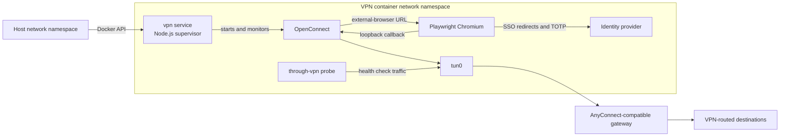
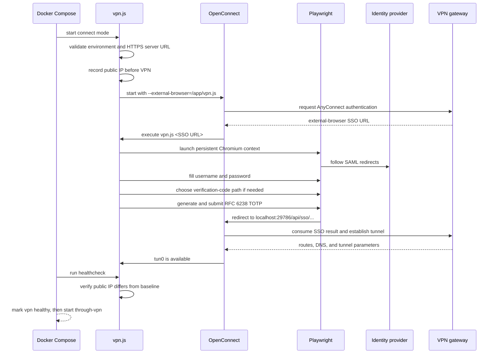

# Autonomous AnyConnect SAML + TOTP VPN sidecar

This project runs an AnyConnect-compatible VPN entirely inside a Docker network
namespace. It is designed for gateways that require a browser-based SAML sign-in,
username and password authentication, and a time-based one-time password (TOTP).
The complete authentication and reconnection path is unattended: OpenConnect starts
the SSO exchange, Playwright drives the identity-provider pages, the script generates
the current RFC 6238 code, and OpenConnect establishes the tunnel.

The host keeps its normal routes, DNS configuration, and public IP. Only containers
that explicitly share the `vpn` service's network namespace use the tunnel.

This is not a general-purpose replacement for every vendor VPN client or every MFA
system. Read [Compatibility and limitations](#compatibility-and-limitations) before
deploying it.

## What this solves

Traditional command-line VPN automation works well when a gateway accepts a username,
password, certificate, or token directly on standard input. It becomes much harder
when the gateway advertises an external-browser SSO method:

1. The VPN client negotiates with the gateway and receives a browser start URL.
2. A real browser must follow redirects through the identity provider.
3. The browser must complete username, password, and MFA pages.
4. The browser is redirected to a loopback callback owned by the VPN client.
5. The VPN client consumes the resulting authentication state and creates the tunnel.

This project keeps those responsibilities separated:

- OpenConnect implements the VPN protocol, owns the loopback SSO callback, configures
  routes and DNS, and maintains the encrypted tunnel.
- Playwright implements the browser session and login-page state machine.
- `vpn.js` supervises both pieces, generates TOTP codes, sanitizes logs, checks real
  egress, and reconnects when the tunnel stops working.
- Docker isolates all network changes from the host.

No browser window, password prompt, TOTP prompt, cookie copy/paste step, or host VPN
installation is required during normal operation.

## Architecture



The Compose stack contains two services built from the same image:

| Service | Purpose |
| --- | --- |
| `vpn` | Runs `vpn.js connect`, OpenConnect, Chromium, the watchdog, and the `tun0` interface. It owns the network namespace. |
| `through-vpn` | Shares `vpn`'s network namespace and continuously proves that the tunnel and public-IP invariant remain valid. It is also a minimal example of how an application can be routed through the VPN. |

The `through-vpn` service uses `network_mode: service:vpn`. It therefore has no
independent network stack: interfaces, routes, DNS, loopback, and public egress are the
same in both containers.

The named `vpn-runtime` volume stores the pre-VPN public IP. It is writable by `vpn`
and read-only in `through-vpn`. It does not store the username, password, or TOTP
secret.

## End-to-end startup sequence



The browser code never extracts or forwards the VPN cookie itself. OpenConnect owns
the local callback and consumes the SSO result. The browser subprocess only completes
the web flow and observes that the callback response occurred.

## Requirements

- A Linux Docker Engine with Docker Compose v2.
- Access to `/dev/net/tun` on the Docker host.
- Permission to grant `NET_ADMIN` inside the `vpn` container.
- Outbound HTTPS and DNS access during image builds and at runtime.
- An AnyConnect-compatible gateway that advertises OpenConnect's
  `single-sign-on-external-browser` authentication method.
- An identity-provider flow compatible with the selectors described in
  [Compatibility and limitations](#compatibility-and-limitations).
- A base32 TOTP seed or an `otpauth://` URI for the account.
- A reasonably synchronized host clock. Containers share the host kernel clock, and
  TOTP normally fails if that clock is significantly wrong.

Rootful Docker is the most predictable environment for TUN device access. Rootless
Docker may work when its user namespace, device access, and networking stack are
configured appropriately, but that setup is host-specific and is not guaranteed by
this Compose file.

## Quick start

### 1. Create the private environment file

Copy the public template and restrict its permissions before adding secrets:

```bash
cp .env.sample .env
chmod 600 .env
```

Edit `.env` and replace every placeholder:

```dotenv
COMPOSE_PROJECT_NAME=vpn-sidecar
VPN_SERVER=https://vpn.example.edu
VPN_USERNAME=user@example.edu
VPN_PASSWORD=replace-me
VPN_TOTP_SECRET=BASE32_TOTP_SECRET
VPN_BROWSER_HEADLESS=true
```

`.env` and all `.env.*` files are excluded from the Docker build context. Git ignores
the same patterns but explicitly allows the placeholder-only `.env.sample`; the sample
does not need to enter the image and remains excluded from the Docker context. Files
matching `*.login.txt` are excluded by both mechanisms. Never put a live value in
`.env.sample`, `compose.yaml`, `vpn.js`, a Dockerfile build argument, or an image label.

Docker Compose dotenv syntax treats unquoted values specially. If a password contains
spaces, `#`, `$`, quotes, or backslashes, use Compose-compatible single quoting and
verify the resolved configuration without printing it. Do not run `docker compose
config` without `--quiet` on a shared terminal because the expanded output can contain
secrets.

### 2. Validate the configuration

```bash
docker compose config --quiet
```

This checks Compose syntax and environment resolution without displaying the rendered
configuration. `vpn.js` performs the application-level checks for required non-empty
values when the container starts.

### 3. Build and start

```bash
docker compose up -d --build --wait
```

The first build compiles the pinned OpenConnect source revision and downloads the
Playwright base image and Node dependencies. It will take longer than subsequent
cached builds.

`--wait` returns only after both services are running and healthy. Normal startup may
take tens of seconds because it includes browser authentication and tunnel setup. The
`vpn` healthcheck has a 90-second Compose start period, while the internal browser
deadline defaults to 180 seconds.

### 4. Inspect status and sanitized logs

```bash
docker compose ps
docker compose logs --no-color vpn through-vpn
```

To follow reconnect activity:

```bash
docker compose logs --follow --no-color vpn through-vpn
```

The script redacts lines that look like cookies, tokens, session IDs, SAML requests,
or SSO callback paths. Credential values are removed from detected authentication
errors, and email-like values in those errors are replaced. Logs still contain the VPN
server and may contain non-secret identity-provider paths or page titles. Treat logs as
sensitive operational data and review them before sharing.

## Configuration reference

### Compose and authentication variables

These are the variables declared by `compose.yaml` and represented in `.env.sample`:

| Variable | Required | Default | Meaning |
| --- | --- | --- | --- |
| `COMPOSE_PROJECT_NAME` | Recommended | Compose directory name | Stable prefix for containers, images, networks, and the named volume. It is consumed by Compose and is not injected into the container. |
| `VPN_SERVER` | Yes | None | HTTPS URL of the AnyConnect-compatible gateway. A group/path may be included if the gateway requires one. Non-HTTPS URLs are rejected. |
| `VPN_USERNAME` | Yes | None | Username or email entered into the identity-provider form. |
| `VPN_PASSWORD` | Yes | None | Password entered into the identity-provider form. |
| `VPN_TOTP_SECRET` | Yes | None | TOTP seed as raw base32, `base32:...`, or an `otpauth://...` URI containing a `secret` query parameter. |
| `VPN_BROWSER_HEADLESS` | No | `true` | Chromium mode. `0`, `false`, or `no`, case-insensitively, select headed mode; every other value selects headless mode. |

Headed Chromium requires a usable display server. The supplied Compose stack is built
and tested for headless operation and does not wire a host display into the container.

### Advanced runtime variables

`vpn.js` also recognizes the following variables. They have safe defaults in code but
are not declared by the base Compose file. To use one from `.env`, add its bare name to
the relevant service's `environment` list in a local Compose override.

| Variable | Default | Used by | Meaning |
| --- | --- | --- | --- |
| `VPN_BROWSER_PROFILE_DIRECTORY` | `/tmp/vpn-browser-profile` | `vpn` | Chromium persistent-context directory. It persists across a restart of the same container, but not container replacement. |
| `VPN_BROWSER_TIMEOUT_MILLISECONDS` | `180000` | `vpn` | Maximum time allowed for the external-browser authentication flow. |
| `VPN_ORIGINAL_PUBLIC_IP_FILE` | `/run/vpn-sidecar/original-public-ip` | Both | Baseline IP file. Both services must use the same value, and the path must be on a shared volume. |
| `VPN_PUBLIC_IP_ENDPOINT` | `https://ifconfig.io/ip` | Both | HTTPS endpoint that must return one plain IPv4 or IPv6 address. Both services must use the same value. |
| `VPN_TUNNEL_INTERFACE` | `tun0` | Both | Interface whose presence proves that OpenConnect configured a tunnel. |
| `VPN_WATCHDOG_FAILURE_THRESHOLD` | `3` | `vpn` | Consecutive failed healthchecks before the supervisor terminates OpenConnect. |
| `VPN_WATCHDOG_INTERVAL_MILLISECONDS` | `30000` | `vpn` | Delay between internal watchdog checks. |
| `VPN_WATCHDOG_STARTUP_GRACE_MILLISECONDS` | Browser timeout plus 30 seconds | `vpn` | Grace period before absence of the initial tunnel counts as a watchdog failure. |

For example, a local `compose.override.yaml` can expose selected tuning variables
without changing the public base file:

```yaml
services:
  vpn:
    environment:
      - VPN_BROWSER_TIMEOUT_MILLISECONDS
      - VPN_PUBLIC_IP_ENDPOINT
      - VPN_WATCHDOG_FAILURE_THRESHOLD
      - VPN_WATCHDOG_INTERVAL_MILLISECONDS

  through-vpn:
    environment:
      - VPN_PUBLIC_IP_ENDPOINT
```

Then add the corresponding values to the private `.env`. Any variable that affects
the healthcheck's file, endpoint, or interface must be passed consistently to both
services.

## Authentication state machine

Identity-provider pages are dynamic and may insert intermediate steps. Instead of
assuming one fixed page sequence, `vpn.js` repeatedly examines the newest browser tab
and performs the first applicable action.

The implemented actions are:

1. Detect a visible TOTP field and submit a freshly generated code.
2. Select a remembered account matching `VPN_USERNAME`.
3. Choose “use another account” when that is the available path.
4. Fill a focused password field and press Enter.
5. Fill a username/email field and submit the form.
6. Select a software-token or verification-code MFA method.
7. Follow English-language alternatives such as “use a verification code” or “enter a code.”
8. Decline the “Stay signed in?” prompt so a durable browser login is not required.
9. Click a generic final “Continue” step when present.

The state machine records its last action so that a static page is not clicked or
submitted repeatedly. It waits briefly after navigation-triggering actions, observes
the newest tab, and logs only when the page title or sanitized location changes.

### TOTP behavior

TOTP generation is implemented directly with Node's cryptographic library:

- RFC 6238 time step: 30 seconds.
- HMAC algorithm: SHA-1.
- Default output: six digits.
- Base32 parsing accepts lowercase, whitespace, hyphens, and padding.
- `base32:` prefixes and standard `otpauth://` URIs are accepted.

If the identity provider visibly rejects a code, the script waits until the next
30-second boundary plus 750 milliseconds and tries a new code. It aborts after three
rejected codes rather than looping forever.

The built-in self-test checks the RFC 6238 test vector at 59 seconds, validates that
the configured seed can generate a code, and verifies that `curl` can obtain a valid
public IP.

## Healthcheck semantics

The healthcheck is deliberately stronger than “the OpenConnect process exists.” A
process can remain alive while routes, DNS, or the tunnel are unusable.

At supervisor startup, before OpenConnect is launched, the script requests
`VPN_PUBLIC_IP_ENDPOINT` and writes the result to the shared baseline file. A healthy
result later requires all of the following:

1. `VPN_TUNNEL_INTERFACE` exists under `/sys/class/net`.
2. The baseline file exists and contains a syntactically valid IP address.
3. A new `curl` request succeeds within seven seconds.
4. The new response is a valid IP address.
5. The new address differs from the pre-VPN baseline.

This proves that the expected interface exists and that real application traffic has
observable VPN egress. Both Compose healthchecks call the same implementation.

### Split-tunnel caveat

The default invariant assumes `ifconfig.io` is routed through the VPN and therefore
returns a different address. A split-tunnel policy may intentionally route public
Internet traffic directly while still routing private destinations through the VPN.
In that case this healthcheck will report unhealthy even though private routes work.

Use a controlled HTTPS endpoint whose response changes across the tunnel, or adapt the
healthcheck to probe a private resource. Any replacement for
`VPN_PUBLIC_IP_ENDPOINT` must return only one plain IP address because the current
parser rejects HTML, JSON, and explanatory text.

## Auto-healing and lifecycle behavior

Recovery happens at three layers:

### 1. OpenConnect transport recovery

OpenConnect runs with `--reconnect-timeout=300`. It can reconnect transient transport
failures without repeating the browser flow when its session remains usable.

### 2. Node.js tunnel watchdog

The supervisor checks the full health invariant every 30 seconds after startup. Three
consecutive failures trigger a controlled `SIGTERM` to the OpenConnect child. The
outer loop waits five seconds, starts a new OpenConnect process, and completes SSO
again. Browser authentication therefore also recovers from expired or irrecoverable
sessions.

Only the OpenConnect child is replaced during this path; PID 1 remains alive. This was
tested by terminating the OpenConnect child, observing a different replacement PID,
and confirming that `tun0` and both service healthchecks recovered.

### 3. Docker restart policies

Both services use `restart: unless-stopped`. Docker restarts them after an unexpected
container exit or daemon restart, unless an operator explicitly stopped them.

`tini` is PID 1 in both containers. It forwards shutdown signals and reaps child
processes. On `SIGINT` or `SIGTERM`, `vpn.js` marks shutdown as requested and terminates
the active OpenConnect child instead of scheduling another reconnect.

The Chromium profile lives in the writable layer at `/tmp/vpn-browser-profile` by
default. A `docker compose restart` retains it and can present a remembered-account
tile. Recreating the container discards it, but fresh username/password/TOTP
authentication remains autonomous.

## Routing another application through the VPN

Use the same network-namespace pattern as `through-vpn`:

```yaml
services:
  application:
    image: your-application-image
    network_mode: service:vpn
    depends_on:
      vpn:
        condition: service_healthy
        restart: true
```

The application will see `tun0`, the VPN routes, and the same DNS configuration as
`vpn`. It does not need `NET_ADMIN` or `/dev/net/tun` itself.

Because the application has no independent network namespace, publish any application
ports on the `vpn` service, not on the application service. All containers sharing the
namespace also share loopback and the port space, so avoid port collisions.

Do not use `network_mode: host`; that would defeat the main isolation property and
allow the VPN client to modify host networking.

## Security model

### Network isolation

The `vpn` container receives only the capability required to configure its own
network namespace:

- All Linux capabilities are dropped.
- `NET_ADMIN` is added back.
- `/dev/net/tun` is passed explicitly.
- No host network mode is used.
- No ports are published by default.

OpenConnect's route and DNS changes therefore affect the shared container namespace,
not the host namespace.

### Credential handling

Live deployment values are kept in `.env`, excluded from Git, and excluded from the
Docker build context. Compose passes the five `VPN_*` values as runtime environment
variables. They are not copied into an image layer or mounted as a credential file.

This is a pragmatic local deployment boundary, not a hardware-backed secret boundary.
Anyone who controls the Docker daemon can inspect a container's environment and
filesystem. Protect the Docker socket, the host account, `.env`, backups, and shell
history accordingly. For a shared or production host, inject the same variables from
an external secret manager instead of storing a long-lived `.env` on disk.

Putting the password and TOTP seed on the same machine weakens the independence of the
second factor. Only use fully unattended TOTP when it is allowed by the account owner
and the organization's security policy. A compromised Docker host can obtain both
factors.

### Browser isolation

Chromium runs inside the container and is launched with `--no-sandbox` because the
container process runs as root. The Docker boundary, dropped capabilities, isolated
network namespace, and absence of host profile mounts are therefore important. The
browser never reuses a host Chrome profile.

The default browser profile is not mounted from the host and is removed with the
container. Persisting that profile would also persist cookies and local storage; treat
such a profile as a secret if you deliberately move it to a volume.

### Log handling

OpenConnect output is streamed line-by-line through a sanitizer. Lines mentioning
cookies, tokens, session IDs, SAML requests, or the callback route are replaced in
full. Other URLs lose query strings and fragments. Authentication error messages are
scrubbed against the configured credential values.

No sanitizer is a substitute for access control. The gateway URL is logged, and new
identity-provider page formats may expose identifiers in titles or paths. Do not send
raw logs to public issue trackers without reviewing them.

## Image construction and reproducibility

The Dockerfile is a two-stage build.

### OpenConnect builder stage

The first Ubuntu Noble stage installs build dependencies, clones the upstream
[OpenConnect repository](https://gitlab.com/openconnect/openconnect), checks out commit
`70d1e79d1e55849dfc71dcc199b1edb535b547e4`, and compiles it with GnuTLS and the
standard `vpnc-script`.

The pinned build disables optional GSSAPI, libproxy, libpskc, and stoken integrations
that this flow does not use. Only the installed runtime tree is copied into the final
image.

Building from a fixed source commit was chosen over relying on a distribution package
because external-browser SSO support is version-sensitive and the exact implementation
can be audited and reproduced.

### Runtime stage

The final stage uses `mcr.microsoft.com/playwright:v1.62.0-noble`, adds OpenConnect's
runtime libraries, `curl`, `iproute2`, `tini`, and `vpnc-scripts`, then installs:

- Playwright `1.62.0` from the lockfile for the embedded authentication browser.
- agent-browser `0.34.0` for contained browser diagnostics and egress verification.
- The compiled OpenConnect runtime from the builder stage.
- The executable `/app/vpn.js` supervisor.

Node dependencies and the OpenConnect commit are exactly pinned. The Playwright base
image is tag-pinned rather than digest-pinned; pin it by digest as well if byte-for-byte
base-image reproducibility is required.

The `--os`, `--useragent`, and `--version-string` OpenConnect arguments present a
contemporary Linux AnyConnect identity to gateways that branch on client metadata.

## Commands exposed by `vpn.js`

| Invocation | Behavior |
| --- | --- |
| `/app/vpn.js connect` | Default mode. Capture baseline IP, run OpenConnect, monitor health, and reconnect forever. |
| `/app/vpn.js healthcheck` | Require the tunnel interface and a public IP different from the baseline. Exit nonzero on failure. |
| `/app/vpn.js probe` | Run the healthcheck every 30 seconds forever and log healthy/unhealthy transitions. |
| `/app/vpn.js self-test` | Verify required credential variables, RFC 6238 generation, configured TOTP decoding, and public-IP access. |
| `/app/vpn.js https://...` | External-browser mode invoked by OpenConnect. Launch Chromium and drive authentication for the supplied URL. |

The URL form is an internal protocol between OpenConnect and the script; operators
normally use only the first four modes.

## Verification

### Manual healthchecks

```bash
docker compose exec -T vpn /app/vpn.js healthcheck
docker compose exec -T through-vpn /app/vpn.js healthcheck
```

Expected output from each command:

```text
healthy: public IP differs from the pre-VPN public IP
```

### TOTP and environment self-test

```bash
docker compose exec -T vpn /app/vpn.js self-test
```

Expected output:

```text
self-test passed: environment credentials, RFC 6238 TOTP, and curl verified
```

The test never prints the generated code or configured seed.

### Confirm the interface and network namespace

```bash
docker compose exec -T vpn ip link show tun0
docker compose exec -T through-vpn ip link show tun0
docker compose exec -T vpn readlink /proc/1/ns/net
docker compose exec -T through-vpn readlink /proc/1/ns/net
```

Both namespace links should be identical.

### Compare host and VPN egress

```bash
printf 'host: '
curl --fail --silent --show-error https://ifconfig.io/ip

printf 'vpn:  '
docker compose exec -T vpn \
  curl --fail --silent --show-error https://ifconfig.io/ip
```

The two IP addresses must differ under the default full-tunnel health model.

### Verify Chromium egress with agent-browser

The runtime image contains agent-browser specifically so a real Chromium page can be
tested inside the VPN namespace rather than assuming browser and `curl` routing are
equivalent:

```bash
BROWSER_PATH="$(
  docker compose exec -T vpn \
    node -p "require('playwright').chromium.executablePath()"
)"

printf '%s' '[
  ["open", "https://ifconfig.io/ip"],
  ["wait", "--load", "domcontentloaded"],
  ["get", "text", "body"],
  ["close"]
]' | docker compose exec -T \
  -e AGENT_BROWSER_CONTENT_BOUNDARIES=1 \
  -e AGENT_BROWSER_MAX_OUTPUT=20000 \
  -e AGENT_BROWSER_EXECUTABLE_PATH="$BROWSER_PATH" \
  vpn agent-browser \
    --session vpn-egress-proof \
    --allowed-domains ifconfig.io \
    batch --bail --json
```

This uses one named session, restricts browser traffic to `ifconfig.io`, stops at the
first failed command, and closes the session in the same batch.

### Exercise child-process auto-healing

This test intentionally interrupts the tunnel while leaving the Node supervisor alive:

```bash
docker compose exec -T vpn sh -lc '
  for process_file in /proc/[0-9]*/comm; do
    if [ "$(cat "$process_file")" = openconnect ]; then
      process_directory="${process_file%/comm}"
      kill -TERM "${process_directory##*/}"
    fi
  done
'

docker compose up -d --wait --wait-timeout 240
docker compose exec -T vpn /app/vpn.js healthcheck
docker compose exec -T through-vpn /app/vpn.js healthcheck
```

The logs should contain `openconnect.start.exit`,
`openconnect.restart.scheduled`, a new `openconnect.start.enter`, an accepted SSO
callback, and restored healthy checks.

### Exercise full-container restart

```bash
docker compose restart --timeout 30 vpn through-vpn
docker compose up -d --wait --wait-timeout 240
```

This preserves the existing containers and therefore the default Chromium profile.
The login may select the remembered account before generating a new TOTP code.

## Troubleshooting

### `VPN_SERVER must use HTTPS`

`VPN_SERVER` is empty, malformed, or does not begin with `https://`. Include any
required gateway group as a URL path rather than changing the scheme.

### Environment is missing required fields

The named variable was not injected into `vpn`. Confirm that `.env` is in the same
directory as `compose.yaml`, its assignments have no misspelled keys, and the file is
readable by the user running Docker Compose.

Use `docker compose config --quiet` for validation. Avoid printing the fully rendered
configuration while debugging secrets.

### `/dev/net/tun` is missing or permission is denied

Confirm the device exists on the host:

```bash
test -c /dev/net/tun
```

If it does not, load or enable the host TUN driver. If it exists but Docker cannot pass
it through, check daemon device policy, user-namespace configuration, and whether the
current Docker environment permits `NET_ADMIN`.

### `Tunnel interface tun0 is absent`

Authentication may still be running, OpenConnect may have exited, or the gateway may
have rejected the session. Inspect the `vpn` logs from the beginning of the current
container lifecycle. Look for browser state transitions, the SSO callback event, and
OpenConnect's sanitized negotiation output.

### Browser authentication times out

Likely causes include:

- The identity provider added a page or selector not covered by the state machine.
- The account requires push approval, WebAuthn/passkey, CAPTCHA, device compliance, or
  another interactive factor.
- The page is localized and no longer matches the English fallback text.
- A conditional-access policy rejects the container/browser environment.
- The gateway or identity provider is unreachable from the pre-VPN network.

Temporarily add state logging or inspect the page in a controlled development
environment. Never publish screenshots containing credentials, TOTP codes, session
URLs, or account identifiers.

### Username or password is rejected

The script detects visible username/password error regions after submitting those
fields and exits the browser subprocess with a generic rejection error. Check the
private `.env`, account state, and identity-provider policy. The supervisor will retry
after OpenConnect exits, so stop the service while correcting persistently invalid
credentials to avoid repeated sign-in attempts.

### TOTP is rejected

Check all of the following:

- The seed belongs to the same account as `VPN_USERNAME`.
- The seed is base32 or a valid `otpauth://` URI.
- The host clock is synchronized.
- The identity provider expects a six-digit SHA-1 TOTP with a 30-second period.
- The selected MFA method is a verification code, not a push notification.

The code waits for a fresh time window after a visible rejection and stops after three
attempts.

### Healthcheck fails although private resources work

This is usually split tunneling. If `ifconfig.io` is intentionally routed outside the
VPN, the public IP will not change. Select an endpoint with a deterministic VPN-only
result or replace the health invariant with a private connectivity probe.

### `curl ifconfig.io returned an invalid public IP address`

The endpoint returned HTML, JSON, a proxy error, multiple addresses, or explanatory
text. The parser intentionally accepts only a bare IPv4 or IPv6 value.

### The watchdog reconnects repeatedly

Search for `watchdog.check.failed` and inspect its error field. Common causes are an
absent interface, DNS failure, a public-IP endpoint blocked by policy, split tunneling,
or unstable gateway connectivity. Increase thresholds only after fixing or
understanding the failing invariant.

### Chromium fails in headed mode

The base stack does not attach a display. Return `VPN_BROWSER_HEADLESS` to `true`, or
provide a dedicated X server/virtual display for debugging. Do not mount a personal
host browser profile into the container.

### Application ports are unreachable

An application using `network_mode: service:vpn` cannot publish ports on its own
service. Add the port mapping to `vpn`; both processes share the same port space.

## Approaches evaluated during development

The final architecture came from testing several plausible approaches and keeping the
parts that behaved deterministically in an unattended container.

### Vendor desktop client

The vendor client is the natural compatibility baseline, but it is built around a
desktop-oriented browser experience and is not an ideal redistributable, auditable
base for a small open-source container. It also obscures the boundary between SSO,
cookie handling, and tunnel lifecycle. OpenConnect provides the required protocol and
external-browser interface as inspectable source.

### Password or token on OpenConnect standard input

This is simpler and should be preferred when a gateway offers a scriptable form. It
does not solve a gateway that requires `single-sign-on-external-browser`. OpenConnect
can suppress external authentication with `--no-external-auth` for gateways that
offer a fallback, but that is not useful when SSO is mandatory.

### `openconnect-sso` with QtWebEngine

The `openconnect-sso` project was inspected because it already wraps OpenConnect and
automates SAML in a browser. Its traditional architecture uses PyQt/QtWebEngine,
desktop/keyring integration, URL/cookie extraction, and optional X11/Xvfb plumbing.
Container examples commonly split authentication and tunnel startup into separate
interactive sessions with manual cookie transfer. That is useful on a workstation but
adds keyring, D-Bus, display-server, and lifecycle dependencies to a headless sidecar.

The useful idea retained from that exploration was selector-based form automation.
The final implementation uses Playwright's bundled Chromium and lets OpenConnect keep
ownership of its loopback callback, eliminating manual cookie extraction.

### Host browser or reused personal Chrome profile

A host browser is convenient for discovering the flow, but it gives the container a
dependency on host UI state, profile locks, browser policies, and local credentials.
It also weakens network isolation because authentication no longer runs in the same
namespace as OpenConnect's callback. The final stack creates its own in-container
profile.

### agent-browser as the runtime driver

agent-browser was used successfully for contained, allowlisted browser egress tests and
is retained in the image as a diagnostic tool. The runtime driver remains the
Playwright library because OpenConnect invokes the external-browser executable with a
one-off URL; handling that call directly in the existing Node process avoids a second
daemon/session lifecycle and keeps credential values out of browser CLI arguments.

### Provider-specific credential file mount

An early private prototype read a local login file and used provider-specific names.
That approach was removed before publication. Runtime deployment values now come from
generic `VPN_*` variables, the login-file pattern is ignored by Git and Docker, and the
public sample contains placeholders only.

### Relying only on process existence or OpenConnect reconnect

An alive process does not prove that traffic uses the VPN. OpenConnect's reconnect
logic is valuable for transient transport loss, but an expired SSO session or stale
tunnel can require a clean authentication cycle. The baseline-IP health invariant,
watchdog threshold, child replacement, and Docker restart policy cover those different
failure layers.

## Development and maintenance

### Local syntax and dependency checks

```bash
node --check vpn.js
npm ci
npm ls --all
docker compose config --quiet
```

### Clean image build

```bash
docker compose build --no-cache
```

The build itself runs `openconnect --version` after installing the compiled runtime,
so a broken library link or missing runtime dependency fails the image build.

### Test checklist for changes

Before publishing a change, verify:

1. `node --check vpn.js` succeeds.
2. `docker compose config --quiet` succeeds with a private test `.env`.
3. A no-cache image build succeeds.
4. `/app/vpn.js self-test` passes inside the built image.
5. A fresh container completes browser SSO without a pre-existing profile.
6. `tun0` appears in both services.
7. Both manual healthchecks pass.
8. Host and container public IPs differ under the full-tunnel model.
9. The contained Chromium egress test matches container `curl` egress.
10. Restarting the same containers reauthenticates and returns to healthy.
11. Terminating only the OpenConnect child produces a new PID and recovers both checks.
12. Complete container logs contain no username, password, TOTP seed, rejection, or
    unexpected fatal event.
13. `.env`, login files, local research, and temporary artifacts remain excluded from
    Git and the Docker build context.

### Updating OpenConnect

Change `OPENCONNECT_COMMIT` only after reviewing upstream changes and completing the
full test checklist. Confirm the built version contains the new commit identifier:

```bash
docker compose exec -T vpn openconnect --version
```

External-browser behavior is the reason the source revision is pinned; do not replace
it with an unversioned branch checkout.

### Updating Playwright

Keep these versions aligned:

- The `mcr.microsoft.com/playwright` Docker image tag.
- `playwright` in `package.json`.
- `playwright` and `playwright-core` in `package-lock.json`.

After an update, repeat both the SSO flow and the agent-browser Chromium egress test.
Browser revisions can change selectors, persistent-profile behavior, and sandbox
requirements.

## Stopping and removing the stack

Stop and remove service containers and the project network while retaining the
baseline volume:

```bash
docker compose down
```

To stop without removing containers:

```bash
docker compose stop
```

The named volume contains only runtime baseline state and is safe to recreate. If you
intentionally want to remove it too:

```bash
docker compose down --volumes
```

The next start captures a new baseline automatically.

## Compatibility and limitations

The current browser state machine is designed around Microsoft-style identity-provider
forms and has been tested with:

- Username/email entry.
- Password entry.
- Remembered-account selection.
- Software-token/TOTP method selection.
- Six-digit verification-code entry.
- “Stay signed in?” and final continuation pages.
- Fresh authentication and authentication after restart/reconnect.

It does not currently automate:

- Push-notification approval.
- SMS or voice codes that must be retrieved externally.
- WebAuthn/passkeys or hardware security keys.
- CAPTCHA.
- Device-compliance registration or endpoint posture software.
- Client certificate selection.
- Identity-provider pages whose selectors or language do not match the implemented
  rules.
- Gateways that do not support OpenConnect's AnyConnect protocol implementation.

Conditional-access policies can change the page sequence based on source IP, device,
browser revision, account, or risk score. Expect to update selectors when an identity
provider redesigns its pages.

## Upstream references

- [OpenConnect](https://gitlab.com/openconnect/openconnect)
- [OpenConnect manual](https://www.infradead.org/openconnect/manual.html)
- [OpenConnect AnyConnect protocol notes](https://www.infradead.org/openconnect/anyconnect.html)
- [openconnect-sso](https://github.com/vlaci/openconnect-sso)
- [Playwright](https://playwright.dev/)
- [RFC 6238: TOTP](https://www.rfc-editor.org/rfc/rfc6238)

## License

The project code is available under the [MIT License](LICENSE). OpenConnect,
Playwright, Chromium, agent-browser, the base images, and system packages retain their
respective upstream licenses.
